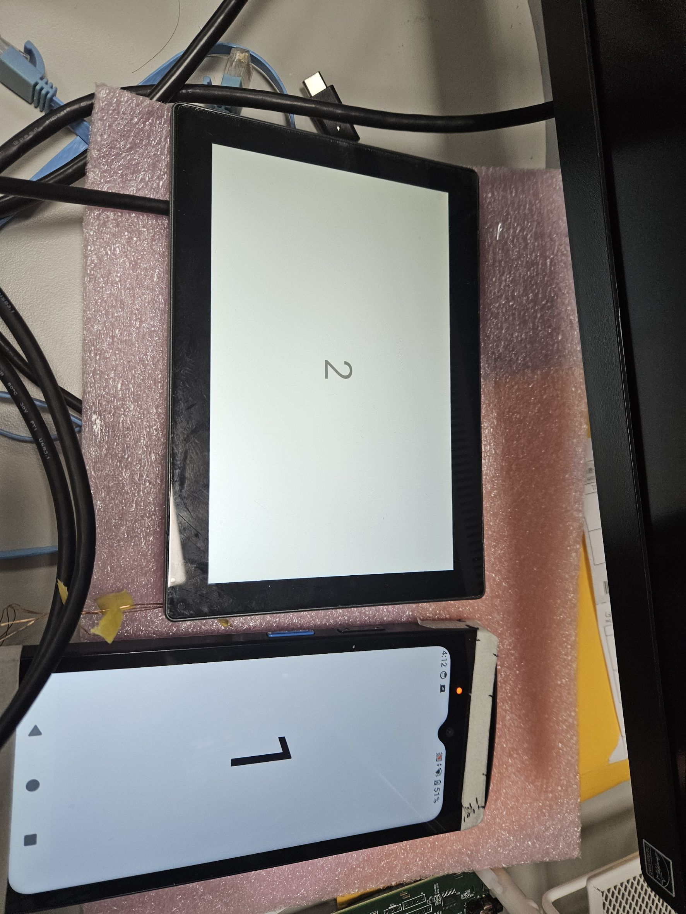

# Android App

一個簡單的 Android 專案範例，展示 android Presentation 使用方法。

## 功能特色
- 使用 **Kotlin** 開發

## 安裝與執行
1. Clone 專案：
   ```bash
   git clone https://github.com/wade9058/externaldisplay-sample.git
   ```


## 實際效果

